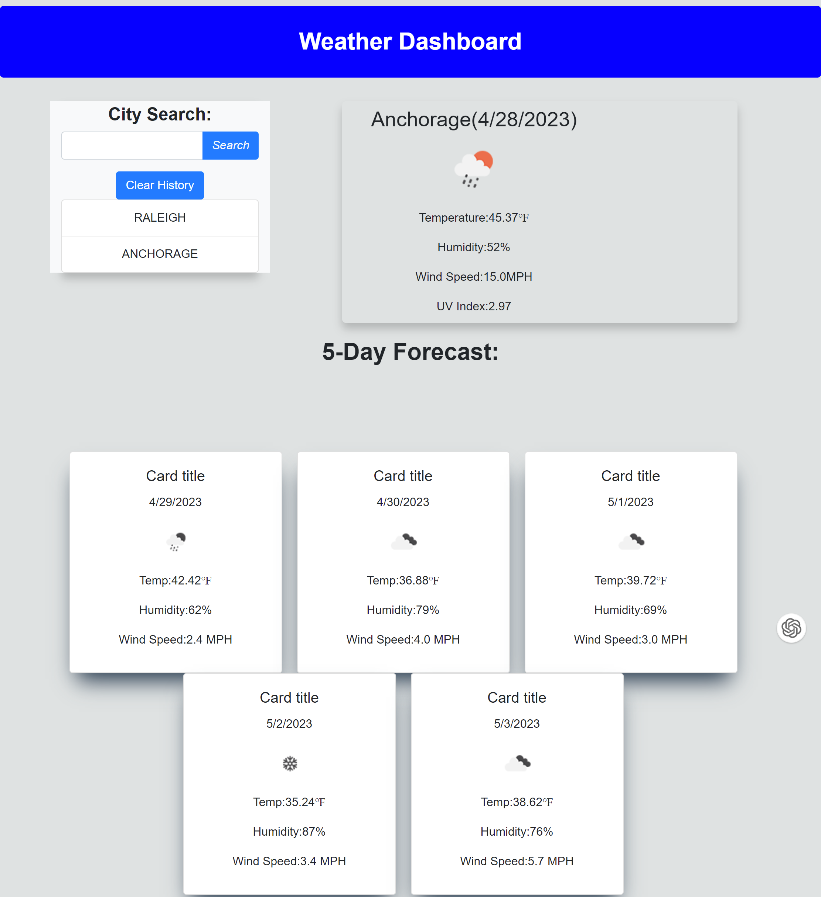

## Weather Dashboard

- This program is a user-friendly web application that helps travelers plan their trips by providing them with the weather outlook for multiple cities. Userc can search for a city and view its current and future weather conditions, allowing them to make informed decisions about their travel plans.

## User Story

- As a traveler, I want to see the weather outlook for multiple cities, so that i can plan a trip accordingly.

## Acceptance Criteria

- Given a weather dashboard with form inputs:
  - When I search for a city, I am presented with current and futures conditions for that city, and that city is added to the search history.
  - When I view current weather conditions for that city, I am presented with the city name, the date, an icon representation of weather conditions, the temperature, the humidity, the windspeed, and an added UV index.
  - When I view future weather conditions for that city, I am presented with a 5-day forecast that displayes the date, and icon representation of weather conditions, the temperature, the wind speed, and the humidity.
  - When I click on a city in the search history, I am again presented with current and future conditions for that city.

## Key Features

- Intuitive weather dashboard with form inputs for searching cities.
- Comprehensive display of current weather conditions including city name, date, weather icon, temperature, humidity, wind speed, and UV Index.
- Informative 5-day forecast showing date, weather icon, temperature, wind speed, and humidity.
- Convenient search history that allows users to quickly view previoulsy searched cities and their weather conditions.

## How to use

1. Navigate to the Weather Dashboard web application.
2. Enter the city name in the input field and click the search button.
3. The program will display the current weather conditions and a 5-day forecast for the entered city.
4. The searched city will be added to the search history for easy future reference.
5. Click on a city in the search history to view its current and future weather conditions again.

[Website](https://ilirhajdari.github.io/your-daily-weather/)
